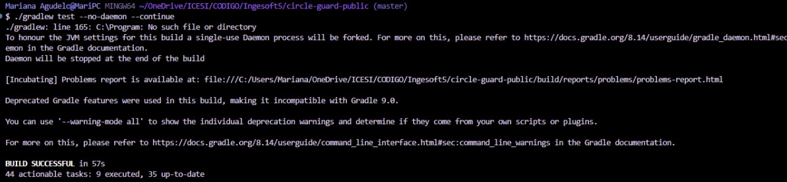
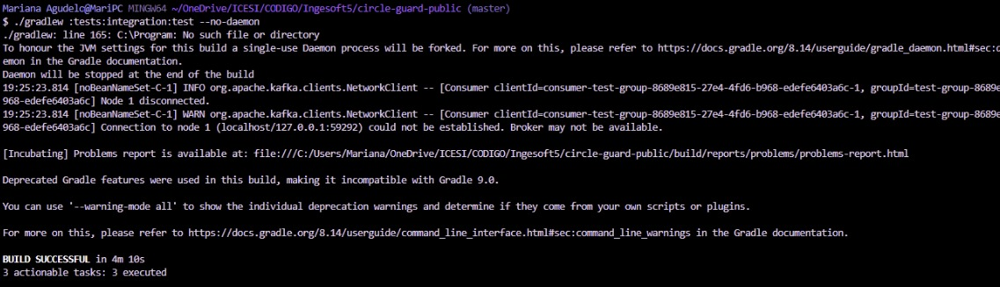

# Informe Taller de Pruebas y Release, CircleGuard

## 1. Descripción del Sistema

CircleGuard es un sistema de microservicios diseñado para el monitoreo de salud en entornos universitarios. Permite gestionar encuestas de síntomas, validar acceso mediante códigos QR, administrar identidades anónimas y notificar exposiciones de riesgo.

### Microservicios desplegados (6)

| Servicio               | Responsabilidad                                       |
| ---------------------- | ----------------------------------------------------- |
| `file-service`         | Almacenamiento y recuperación de archivos de soporte  |
| `form-service`         | Gestión de encuestas de salud y cuestionarios activos |
| `gateway-service`      | Validación de tokens QR en puntos de acceso físico    |
| `identity-service`     | Gestión de identidades anónimas cifradas              |
| `notification-service` | Despacho de alertas de exposición y notificaciones    |
| `promotion-service`    | Motor de estado de salud y seguimiento de ubicación   |

Todos los servicios están implementados en **Java 21 con Spring Boot**, construidos con **Gradle**, y desplegados como contenedores Docker en un clúster **Kubernetes (Minikube)**.


## 2. Infraestructura de CI/CD

### 2.1 Jenkins

Jenkins se ejecuta en un contenedor Docker personalizado basado en `jenkins/jenkins:lts-jdk21`. El Dockerfile del Jenkins (`jenkins/Dockerfile.jenkins`) incluye las siguientes adiciones sobre la imagen base:

- **Docker CLI (`docker.io`):** Permite al agente de Jenkins construir imágenes Docker y ejecutar comandos contra el socket Docker del host, habilitando el patrón Docker-in-Docker necesario para construir y cargar imágenes en Minikube.
- **kubectl:** Binario oficial de Kubernetes instalado directamente en la imagen, necesario para ejecutar todos los comandos de despliegue, rollout status y port-forward contra el clúster.
- **minikube CLI:** Instalado para operaciones de diagnóstico del clúster local.
- **Plugins Jenkins:** `git`, `workflow-aggregator`, `docker-workflow`, `kubernetes-cli`, `junit`, `jacoco`, `pipeline-utility-steps`, `blueocean`, cubriendo SCM, pipelines declarativos, integración Docker/K8s, reporte de pruebas y visualización.

El contenedor Jenkins tiene el socket Docker (`/var/run/docker.sock`) montado desde el host, lo que le permite operar con el daemon Docker del sistema sin necesidad de un daemon Docker propio dentro del contenedor.

### 2.2 Minikube (clúster Kubernetes local)

El clúster Kubernetes se ejecuta mediante **Minikube con driver Docker**, es decir, Minikube corre como un contenedor Docker en la misma máquina. Esto genera una topología de red específica:

- Minikube obtiene su propia subred Docker aislada (`192.168.49.0/24`)
- Jenkins, al vivir en otro contenedor, no puede alcanzar el API server de Minikube (`192.168.49.2:8443`) directamente
- Las imágenes Docker construidas por Jenkins no están disponibles automáticamente dentro del clúster Minikube, ya que cada uno tiene su propio daemon Docker interno

Estas restricciones de red y de registro de imágenes son las que motivan los pasos de **Setup Kubeconfig** y **Docker Build & Load** descritos más adelante.

### 2.3 Estrategia de networking Jenkins ↔ Minikube

Para superar el aislamiento de red, el pipeline implementa dinámicamente la conexión entre ambos contenedores:

```bash
MINIKUBE_IP=$(docker inspect minikube --format='{{range .NetworkSettings.Networks}}{{.IPAddress}}{{end}}')
MINIKUBE_NET=$(docker inspect minikube --format='{{range $k, $v := .NetworkSettings.Networks}}{{$k}}{{end}}')
docker network connect ${MINIKUBE_NET} circleguard-jenkins || true
```

Se detecta en tiempo de ejecución la IP interna de Minikube y su red Docker, luego se une el contenedor Jenkins a esa red. El kubeconfig almacenado como credencial Jenkins apunta a una URL incorrecta (Docker Desktop), por lo que se corrige en el momento:

```bash
sed -i "s|server:.*|server: https://${MINIKUBE_IP}:8443|g" /tmp/minikube-kubeconfig
```

Esta solución es robusta ante reinicios de Minikube, ya que la IP se descubre dinámicamente en cada ejecución del pipeline.

## 3. Estructura de Pipelines

El proyecto implementa **dos pipelines Jenkins independientes**, uno por ambiente:

| Pipeline          | Archivo              | Rama     | Namespace K8s        | Tag imagen |
| ----------------- | -------------------- | -------- | -------------------- | ---------- |
| Stage             | `Jenkinsfile.stage`  | `master` | `circleguard-stage`  | `:stage`   |
| Master/Producción | `Jenkinsfile.master` | `master` | `circleguard-master` | `:latest`  |

Ambos pipelines comparten la configuración base:

- `disableConcurrentBuilds()`: evita ejecuciones simultáneas que generarían conflictos de puertos y recursos en Minikube
- `buildDiscarder(logRotator(numToKeepStr: '5'))`: retención de solo los últimos 5 builds, economizando espacio en disco
- `KUBECONFIG = credentials('kubeconfig')`: gestión segura del archivo kubeconfig mediante el sistema de credenciales de Jenkins, evitando que aparezca en texto plano en los logs

## 4. Pipeline de Stage (`Jenkinsfile.stage`)

### Flujo completo

```
Checkout → Build & Unit Tests → Setup Kubeconfig → Docker Build & Load
→ Deploy Infrastructure → Deploy Microservices
→ System Integration Tests → System E2E Tests
```

### 4.1 Checkout

Clona el repositorio desde GitHub mediante `checkout scm`. Jenkins resuelve automáticamente el repositorio configurado en el job. Esta etapa garantiza que todos los artefactos del pipeline correspondan exactamente al commit que disparó la ejecución.

### 4.2 Build & Unit Tests

```groovy
for (service in services) {
    sh "./gradlew ${gradleModule}:bootJar --no-daemon"
    sh "./gradlew ${gradleModule}:test --no-daemon"
}
```

**Por qué `--no-daemon`:** El daemon de Gradle mantiene un proceso JVM en memoria para acelerar builds subsiguientes. En Jenkins, cada build es efímero y el daemon quedaría huérfano consumiendo RAM. `--no-daemon` garantiza que el proceso Gradle termina limpiamente al finalizar cada tarea, evitando leaks de memoria en el agente.

**Por qué secuencial:** Los 6 servicios se construyen y prueban uno tras otro. Esto incrementa el tiempo total pero garantiza que los logs de errores son claros y atribuibles a un único servicio, facilitando el diagnóstico. En entornos con recursos limitados (Minikube en laptop con 3.9 GB RAM asignados), la construcción paralela puede generar contención de memoria y fallas espurias.

**Reporte de pruebas unitarias:** El bloque `post { always { junit ... } }` recoge los resultados XML de JUnit de todos los servicios y los publica en la interfaz de Jenkins, independientemente del resultado del build.

**Pruebas unitarias por servicio:**

| Servicio             | Clases de prueba destacadas                                                                                            |
| -------------------- | ---------------------------------------------------------------------------------------------------------------------- |
| form-service         | `HealthSurveyControllerTest`, `QuestionnaireControllerTest`, `SymptomMapperTest`, `HealthSurveyServiceTest`            |
| gateway-service      | `GateControllerTest`, `QrValidationServiceTest`, `QrValidationServiceExtendedTest`                                     |
| identity-service     | `IdentityVaultControllerTest`, `IdentityEncryptionConverterTest`, `IdentityVaultServiceTest`                           |
| notification-service | `ExposureNotificationListenerTest`, `NotificationDispatcherTest`, `NotificationRetryTest`, `PriorityAlertListenerTest` |
| promotion-service    | `HealthStatusServiceTest`, `StatusLifecycleTest`, `SurveyListenerTest`, `FloorServiceTest`                             |
| file-service         | `FileUploadControllerTest`, `FileStorageServiceTest`                                                                   |



### 4.3 Setup Kubeconfig

Etapa crítica que resuelve el problema de conectividad Jenkins ↔ Minikube descrito en la sección 2.3. Se ejecuta después del build (no antes) porque no requiere código fuente compilado y su resultado (`/tmp/minikube-kubeconfig`) persiste para todas las etapas siguientes dentro del mismo nodo Jenkins.

### 4.4 Docker Build & Load

```groovy
sh "docker build --pull=false -f services/circleguard-${service}/Dockerfile -t ${image} ."
sh "docker save ${image} | docker exec -i minikube docker load"
```

**Por qué `--pull=false`:** Evita que Docker intente actualizar la imagen base desde Docker Hub en cada build. Las imágenes base (`eclipse-temurin:21-jre-alpine`) ya están en caché local. Sin este flag, cada build generaría un pull innecesario que consume tiempo y puede fallar si Docker Hub tiene problemas de conectividad.

**Por qué `docker save | docker exec -i minikube docker load`:** Minikube con driver Docker tiene su propio daemon Docker interno aislado del daemon del host. Las imágenes construidas por Jenkins no son visibles dentro del clúster. El pipe `docker save | docker exec -i minikube docker load` transfiere la imagen directamente en memoria (sin usar disco ni registro) al daemon interno de Minikube, haciéndola disponible para los pods con `imagePullPolicy: Never`.

**Tags diferenciados:** Las imágenes en Stage se etiquetan `:stage`, permitiendo coexistir con las imágenes de producción (`:latest`) en el mismo daemon de Minikube sin sobreescribirse.

### 4.5 Deploy Infrastructure

Antes de desplegar los microservicios, se aprovisiona la infraestructura de soporte mediante `k8s/stage/infrastructure.yaml`:

| Componente        | Imagen                            | Justificación                                                                                                                                |
| ----------------- | --------------------------------- | -------------------------------------------------------------------------------------------------------------------------------------------- |
| **PostgreSQL 16** | `postgres:16-alpine`              | Base de datos relacional principal para todos los microservicios que persisten datos de negocio                                              |
| **Redis 7**       | `redis:7-alpine`                  | Caché en memoria para tokens QR validados y sesiones activas en gateway-service                                                              |
| **Zookeeper**     | `confluentinc/cp-zookeeper:7.6.0` | Coordinador de metadatos requerido por Kafka para gestión del clúster broker                                                                 |
| **Apache Kafka**  | `confluentinc/cp-kafka:7.6.0`     | Message broker para comunicación asíncrona entre servicios (eventos `survey.submitted`, `certificate.validated`, `promotion.status.changed`) |
| **Neo4j 5**       | `neo4j:5`                         | Base de datos de grafos para el motor de recomendación y seguimiento de contactos del promotion-service                                      |

**Por qué se verifica el rollout status:** El pipeline espera activamente a que cada deployment de infraestructura esté en estado `Ready` antes de continuar. Si los microservicios se despliegan antes de que Postgres o Kafka estén disponibles, los pods Spring Boot fallarán en el startup con errores de conexión y entrarán en `CrashLoopBackOff`. Los timeouts configurados reflejan los tiempos reales de arranque observados:

- Postgres/Redis: 120s (rápidos, listos en ~10-30s)
- Kafka: 180s (requiere coordinación con Zookeeper)
- Neo4j: 180s (JVM pesada, inicialización de base de grafos)

**Por qué Kafka y Neo4j tienen `|| echo 'Warning'`:** En un entorno con recursos limitados como Minikube en laptop (3.9 GB RAM, 2 CPUs), estos servicios consumen más memoria y pueden necesitar más tiempo del timeout en primera ejecución o cuando ambos ambientes (stage y master) corren simultáneamente. El flag hace que el pipeline no falle por un timeout de rollout status, dado que el pod eventualmente estará listo cuando los microservicios lo necesiten, estos tienen sus propios mecanismos de retry de conexión.

**Pre-pull de imágenes de infraestructura:**

```bash
docker exec minikube docker pull postgres:16-alpine
docker exec minikube docker pull redis:7-alpine
# ...
```

Las imágenes de infraestructura se descargan explícitamente al daemon interno de Minikube antes de aplicar los YAMLs. Esto garantiza que el tiempo de arranque de los pods no incluye el tiempo de descarga de la imagen, haciendo el rollout status más predecible.

### 4.6 Deploy Microservices

```groovy
sh "kubectl apply -f k8s/${env}/${service}.yaml --namespace=${namespace}"
sh "kubectl rollout status deployment/${service} --timeout=120s || echo 'Warning'"
```

Cada microservicio tiene su propio YAML de Kubernetes con `Deployment` + `Service`. Las variables de entorno inyectadas a cada pod configuran las conexiones a la infraestructura por nombre de servicio DNS interno de Kubernetes (`postgres`, `kafka`, `neo4j`, `redis`), que Kubernetes resuelve automáticamente dentro del namespace.

`imagePullPolicy: Never` indica a Kubernetes que no intente descargar la imagen de ningún registro externo, debe existir localmente en el daemon de Minikube (garantizado por la etapa anterior).

### 4.7 System Integration Tests

```groovy
catchError(buildResult: 'SUCCESS', stageResult: 'UNSTABLE') {
    sh "./gradlew :tests:integration:test --no-daemon"
}
```

Las pruebas de integración validan la comunicación entre microservicios a nivel de mensajería. Utilizan **Testcontainers** para levantar instancias aisladas de Kafka en el mismo proceso de prueba, sin depender del Kafka del clúster:

| Caso de prueba                                                | Validación                                                                                   |
| ------------------------------------------------------------- | -------------------------------------------------------------------------------------------- |
| `IT-01: shouldPublishSurveySubmittedEventToKafka`             | form-service publica en el tópico `survey.submitted` con los campos correctos                |
| `IT-02: shouldPublishCertificateValidatedEventWhenApproved`   | Se publica el evento `certificate.validated` con estado `APPROVED`                           |
| `IT-03: shouldPublishStatusChangedEventAfterSymptomsDetected` | promotion-service emite `promotion.status.changed` con estado `SUSPECT` al detectar síntomas |
| `IT-04: PromotionToGatewayRedisIntegrationTest`               | Validación del flujo de caché Redis entre promotion-service y gateway-service                |

**Por qué `catchError`:** Si las pruebas de integración fallan, el pipeline continúa con `buildResult: 'SUCCESS'` y `stageResult: 'UNSTABLE'`. Esto es intencional: un fallo en integración puede deberse a datos de prueba o condiciones de timing, no necesariamente a un defecto en la lógica del servicio. El estado UNSTABLE alerta al equipo sin bloquear el deployment.



### 4.8 System E2E Tests

```bash
kubectl port-forward -n circleguard-stage svc/gateway-service  8087:8080 &
kubectl port-forward -n circleguard-stage svc/identity-service 8083:8080 &
kubectl port-forward -n circleguard-stage svc/form-service     8086:8080 &
sleep 15
./gradlew :tests:e2e:test --no-daemon
```

Las pruebas E2E validan flujos completos de usuario a través de múltiples microservicios, simulando el comportamiento real del sistema. Se implementaron dos escenarios:

| Prueba E2E                      | Flujo validado                                                                             |
| ------------------------------- | ------------------------------------------------------------------------------------------ |
| `GatewayAndIdentityFlowE2ETest` | Registro de identidad anónima → validación de token QR en gateway → verificación de acceso |
| `SurveyFlowE2ETest`             | Autenticación → envío de encuesta de síntomas → respuesta del sistema                      |

**Por qué port-forward:** Los tests E2E corren en el proceso JVM de Jenkins (fuera del clúster Kubernetes). El DNS interno del clúster (`*.svc.cluster.local`) no es resoluble desde Jenkins. `kubectl port-forward` crea túneles TCP que exponen los servicios del clúster en puertos locales de Jenkins (`localhost:8087`, etc.), permitiendo que los tests se conecten con URLs estándar HTTP.

**Por qué `sleep 15`:** Los túneles `port-forward` se establecen de forma asíncrona. Sin espera, los primeros requests del test encuentran el puerto aún no disponible y fallan con `Connection refused`. 15 segundos es suficiente para que los tres port-forwards estén activos.


## 5. Pipeline de Producción (`Jenkinsfile.master`)

### Flujo completo

```
Checkout → Build & Unit Tests → Setup Kubeconfig → Docker Build & Load
→ Approval → Deploy Infrastructure → Deploy Microservices
→ System Integration Tests → Smoke Tests → Performance Tests → Release Notes
```

El pipeline de master extiende el de stage con etapas adicionales propias de un ambiente productivo.

### 5.1 Etapa de Aprobación Manual

```groovy
stage('Approval') {
    steps {
        timeout(time: 30, unit: 'MINUTES') {
            input message: "¿Aprobar despliegue a MASTER del sistema completo?", ok: 'Desplegar'
        }
    }
}
```


Esta etapa implementa un **gate de aprobación humana** antes del deployment a producción. El pipeline se pausa y espera confirmación explícita de un operador autorizado. Si nadie aprueba en 30 minutos, el pipeline se cancela automáticamente.

**Justificación:** En producción, el despliegue automático sin revisión humana representa un riesgo operacional. El gate garantiza que un responsable ha revisado los resultados del build y los tests antes de que el código llegue al ambiente productivo. Este patrón es estándar en pipelines de CD maduros (Change Approval Board en ITIL, Protected Branches con required reviewers en GitHub).

**Por qué está entre Docker Build y Deploy Infrastructure:** Las imágenes ya están construidas y cargadas en Minikube, por lo que el operador puede revisar que el build fue exitoso antes de aprobar. Si el build falló, la aprobación nunca llega.

### 5.2 Smoke Tests

```bash
curl -sf http://localhost:9081/actuator/health && echo 'file-service OK'
curl -sf http://localhost:9082/actuator/health && echo 'form-service OK'
# ... (6 servicios)
```

Los smoke tests verifican que **todos los microservicios desplegados están vivos y respondiendo** en su endpoint de salud de Spring Boot Actuator (`/actuator/health`). Se ejecutan mediante port-forward hacia los puertos 9081-9086.

**Diferencia con las pruebas E2E:** Los smoke tests no validan lógica de negocio, solo confirman que el servicio levantó correctamente (JVM arrancó, contexto Spring cargó, conexiones a bases de datos establecidas). Son la primera validación post-deployment en producción.

**Por qué `curl -sf`:** El flag `-s` suprime la barra de progreso. El flag `-f` hace que curl retorne código de salida distinto de 0 si el servidor responde con código HTTP de error (4xx, 5xx). Combinado con `|| echo 'WARNING'`, cada servicio es evaluado independientemente sin detener la verificación de los demás.

### 5.3 Performance Tests (Locust)

```bash
locust -f tests/performance/locustfile.py --headless -u 10 -r 2 -t 15s \
    --host=http://localhost:9091 --class-picker FormServiceUser \
    --csv=build/locust/form-service
```

Las pruebas de carga se ejecutan con **Locust**, un framework Python de performance testing. Se prueban 3 servicios con user classes específicas:

| Servicio          | User Class             | Escenarios simulados                                                                  |
| ----------------- | ---------------------- | ------------------------------------------------------------------------------------- |
| form-service      | `FormServiceUser`      | Submit encuesta sin síntomas (70%), con síntomas (20%), GET cuestionario activo (10%) |
| gateway-service   | `GatewayServiceUser`   | Validación token QR válido (80%), token inválido (20%)                                |
| promotion-service | `PromotionServiceUser` | Señal WiFi BLE (80%), consulta estadísticas (20%)                                     |

Parámetros: **10 usuarios virtuales**, spawn rate **2 usuarios/segundo**, duración **15 segundos por servicio**. Los resultados se exportan en CSV (p50, p95, p99, throughput, tasa de error) y se archivan como artefactos del build.


### 5.4 Release Notes

```bash
bash jenkins/scripts/generate-release-notes.sh
archiveArtifacts artifacts: 'CHANGELOG.md'
```

Script que genera automáticamente el `CHANGELOG.md` a partir del historial de Git (`git log`), extrayendo commits desde el último tag hasta `HEAD`. El artefacto se adjunta al build de Jenkins, proporcionando trazabilidad de qué cambios incluye cada release de producción.

## 6. Estrategia de Pruebas, Pirámide de Testing

```
          ▲
        /E2E\          → 2 flujos completos de usuario (stage únicamente)
       /──────\
      / Smoke  \       → 6 health checks post-deploy (master)
     /──────────\
    / Integration\     → 4 pruebas Kafka + Redis con Testcontainers (ambos)
   /──────────────\
  /   Unit Tests   \   → ~30 pruebas por controladores y servicios (ambos)
 /──────────────────\
/   Performance      \ → Locust 10 VU × 3 servicios, 15s cada uno (master)
```

**Cobertura por ambiente:**

| Tipo de prueba    | Stage | Master |
| ----------------- | ----- | ------ |
| Unit Tests        | ✅    | ✅     |
| Integration Tests | ✅    | ✅     |
| E2E Tests         | ✅    | ❌     |
| Smoke Tests       | ❌    | ✅     |
| Performance Tests | ❌    | ✅     |

**Justificación del diseño:** Stage ejecuta E2E porque es el ambiente donde se valida la funcionalidad completa antes de promover a producción. Master ejecuta Smoke y Performance porque en producción la prioridad es verificar que el sistema está operativo y puede soportar carga real, no re-ejecutar flujos funcionales ya validados en stage.

## 7. Análisis de Tiempos de Ejecución

### ¿Por qué los pipelines toman ~35-45 minutos?

El tiempo de ejecución es significativamente mayor que implementaciones equivalentes porque el entorno impone restricciones que no existen en pipelines cloud-native:

**1. Construcción secuencial de 6 microservicios (~18 minutos)**

Los 6 servicios se construyen y prueban uno tras otro (no en paralelo). Cada ciclo `bootJar + test` por servicio toma 3-5 minutos con Gradle `--no-daemon` en un JVM frío. En total: ~18-20 minutos solo en build.

_¿Por qué no paralelizar?_ Con Minikube usando 3.9 GB de RAM y 2 CPUs, lanzar 6 procesos JVM de Gradle simultáneamente causaría OOM y builds fallidos. La estabilidad se prioriza sobre la velocidad en este entorno.

**2. Transferencia de imágenes Docker a Minikube (~5 minutos)**

Cada imagen Spring Boot pesa 80-120 MB. Las 6 imágenes se transfieren secuencialmente al daemon interno de Minikube mediante `docker save | docker exec -i minikube docker load`, sumando ~600 MB de datos transferidos en memoria. Esta operación no existe en pipelines que usan un registro Docker externo (Docker Hub, ECR) al que el clúster tiene acceso directo.

**3. Arranque de infraestructura con esperas explícitas (~5 minutos)**

El pipeline verifica activamente que Postgres, Redis, Zookeeper, Kafka y Neo4j estén `Ready` antes de continuar. Neo4j es particularmente lento (~60-90s) por su inicialización de base de grafos. Esta espera es necesaria para garantizar que los microservicios Spring Boot no fallan al iniciar por dependencias no disponibles.

**4. E2E y Smoke Tests con port-forward (~8 minutos)**

Los tests requieren port-forwards activos para conectarse a los servicios del clúster. El `sleep 15` antes de ejecutar los tests añade tiempo de espera inevitable.

**5. Instalación de Locust en tiempo de ejecución (~2 minutos)**

`apt-get install python3-pip` + `pip install locust` en cada ejecución del pipeline agrega tiempo que en pipelines con agentes pre-configurados no existiría.

### Comparación con pipelines más rápidos

Pipelines que completan en ~15-16 minutos típicamente implementan:

- **Construcción paralela** de servicios (`parallel {}` en Groovy), posible solo con suficiente RAM
- **Multi-stage Docker builds** con layer caching (capas de dependencias separadas de código de aplicación), reduciendo tiempos de build en re-ejecuciones
- **Sin gate de aprobación manual** en stage (aprobación automática)
- **Sin performance tests** en el pipeline principal

Nuestro pipeline prioriza **robustez y completitud de pruebas** sobre velocidad de ejecución, con un espectro completo de testing (unit → integration → E2E → smoke → performance) que incrementa la confianza en cada release.

## 8. Decisiones de Diseño Clave

### 8.1 Namespace separado por ambiente

Cada ambiente tiene su propio namespace Kubernetes (`circleguard-stage`, `circleguard-master`). Esto garantiza aislamiento total: un fallo en stage no afecta master, y ambos pueden ejecutarse simultáneamente sin interferencia de servicios ni puertos.


### 8.2 Imágenes sin registro externo

Las imágenes se cargan directamente en Minikube sin usar Docker Hub ni un registro privado. Esta decisión simplifica la configuración (no se necesitan credenciales de registro) y elimina la dependencia de conectividad externa durante el deploy. La contrapartida es el tiempo adicional de la transferencia `docker save | docker load`.

### 8.3 TLS skip en kubectl

Todos los comandos kubectl usan `--insecure-skip-tls-verify=true`. En producción real esto sería inaceptable, pero en este entorno local el certificado TLS del API server de Minikube fue generado para la IP original del clúster, que cambia tras reinicios. Verificar TLS requeriría regenerar o distribuir el certificado correcto en cada reinicio, añadiendo complejidad operacional sin beneficio de seguridad en un entorno de desarrollo local aislado.

### 8.4 `catchError` en pruebas post-deploy

Las pruebas de integración, smoke y performance están envueltas en `catchError(buildResult: 'SUCCESS', stageResult: 'UNSTABLE')`. Esto implementa el principio de **fail-fast para defectos bloqueantes, warn-only para métricas de calidad**: un fallo en pruebas funcionales no impide ver los resultados de las demás pruebas ni los artefactos generados (release notes, CSVs de Locust).

## 9. Estructura de Archivos del Proyecto

```
circle-guard-public/
├── jenkins/
│   ├── Dockerfile.jenkins          # Imagen Jenkins customizada
│   ├── docker-compose.jenkins.yml  # Composición del entorno Jenkins
│   ├── pipelines/
│   │   ├── Jenkinsfile.stage       # Pipeline ambiente stage
│   │   └── Jenkinsfile.master      # Pipeline ambiente producción
│   └── scripts/
│       └── generate-release-notes.sh
├── services/
│   ├── circleguard-file-service/
│   ├── circleguard-form-service/
│   ├── circleguard-gateway-service/
│   ├── circleguard-identity-service/
│   ├── circleguard-notification-service/
│   └── circleguard-promotion-service/
├── tests/
│   ├── integration/               # Testcontainers Kafka + Redis
│   ├── e2e/                       # Flujos completos HTTP
│   └── performance/
│       └── locustfile.py          # Load tests Locust
├── k8s/
│   ├── stage/
│   │   ├── infrastructure.yaml    # Postgres, Kafka, Redis, Neo4j (stage)
│   │   ├── file-service.yaml
│   │   ├── form-service.yaml
│   │   ├── gateway-service.yaml
│   │   ├── identity-service.yaml
│   │   ├── notification-service.yaml
│   │   └── promotion-service.yaml
│   └── master/
│       ├── infrastructure.yaml    # Postgres, Kafka, Redis, Neo4j (master)
│       └── [6 service YAMLs]
└── CHANGELOG.md                   # Generado automáticamente por el pipeline
```
