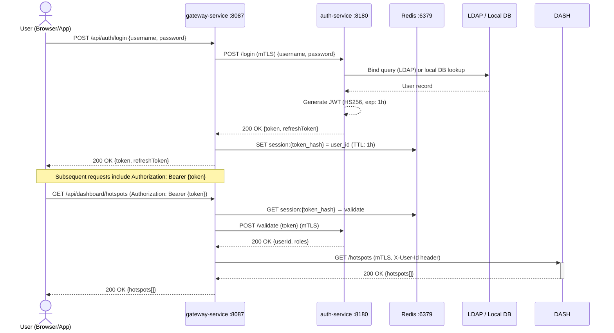
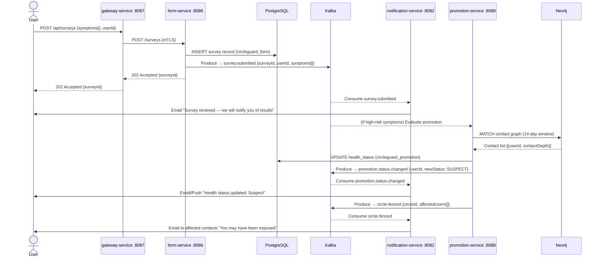
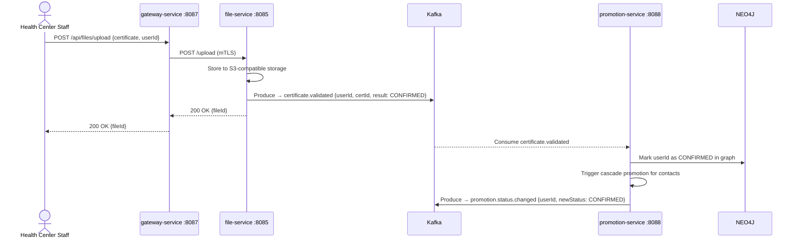
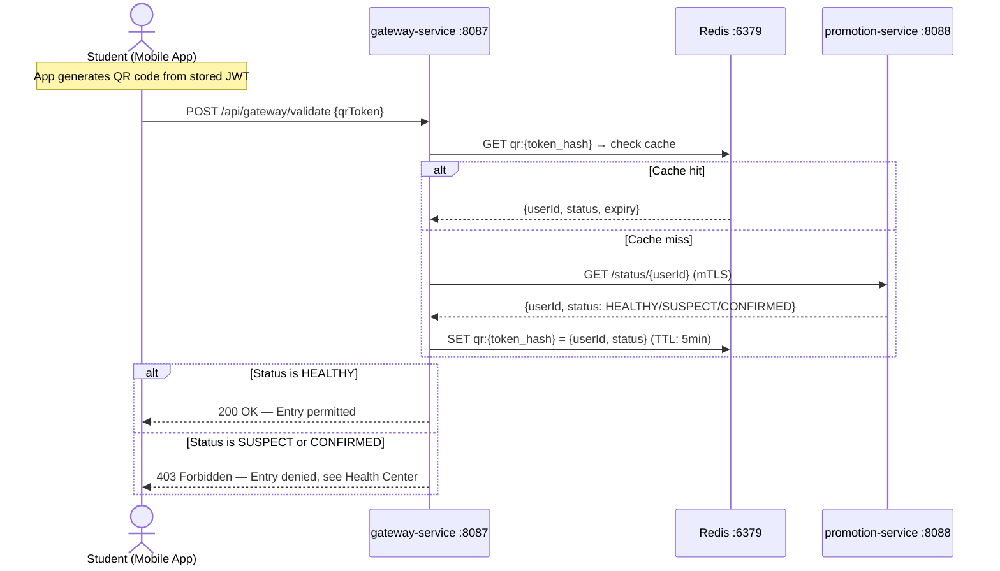

# CircleGuard Data Flow Diagrams

Key data flows through the system.

---

## Flow 1: User Login and JWT Issuance

---

## Flow 2: Health Survey Submission and Notification

---

## Flow 3: Certificate Upload and Validation

---

## Flow 4: Campus Entry QR Validation

