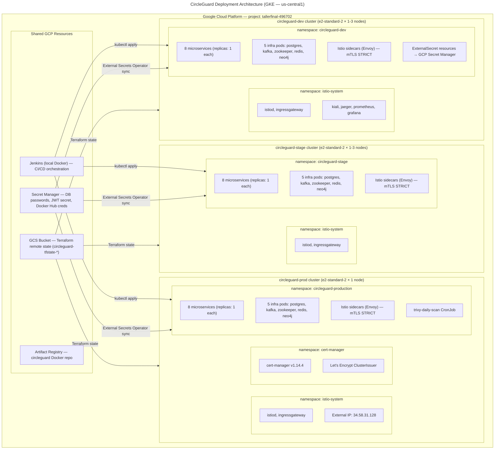

# CircleGuard Deployment View

GKE clusters across three environments with node counts, namespaces, and components.

---



---

## Environment Sizing

| Environment | Cluster Name | Node Type | Nodes | Purpose |
|-------------|-------------|-----------|-------|---------|
| Dev | `circleguard-dev` | e2-standard-2 (2 vCPU, 8 GB) | 1–3 (autoscale 0–3) | Development, CI pipeline testing |
| Stage | `circleguard-stage` | e2-standard-2 | 1–3 (autoscale 0–3) | Pre-production validation, ZAP scans |
| Production | `circleguard-prod` | e2-standard-2 | 1 (autoscale 0–3) | Live traffic |

All clusters are in region `us-central1`. Clusters are scaled to 0 nodes between sessions to stay within the `CPUS_ALL_REGIONS=12` quota and minimize costs.

---

## Network Topology

```
Internet
    |
    | HTTPS :443 / HTTP :80
    ↓
GCP External Load Balancer (IP: 34.58.31.128)
    |
    ↓
Istio Ingress Gateway (istio-system namespace)
    |
    | mTLS
    ↓
Application Pods (circleguard-production namespace)
    |
    | mTLS (all service-to-service)
    ↓
Infrastructure Pods (PostgreSQL, Kafka, Redis, Neo4j)
    (no Istio sidecar — enableServiceLinks: false)
```
