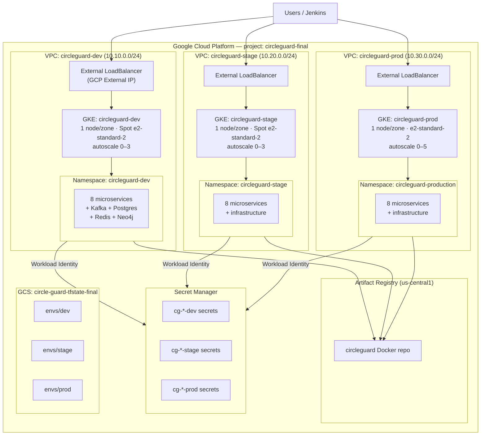

# Infrastructure Architecture

CircleGuard GCP infrastructure — three environments on GKE.

## Network addressing

| Env   | Nodes           | Pods            | Services        |
|-------|-----------------|-----------------|-----------------|
| dev   | 10.10.0.0/24    | 10.10.4.0/22    | 10.10.8.0/24    |
| stage | 10.20.0.0/24    | 10.20.4.0/22    | 10.20.8.0/24    |
| prod  | 10.30.0.0/24    | 10.30.4.0/22    | 10.30.8.0/24    |

## Terraform state

All state in `gs://circle-guard-tfstate-final/` with per-env prefix (`envs/dev`, `envs/stage`, `envs/prod`).

## IAM / Workload Identity

Each namespace has:
- One ESO service account (`eso-sa-<env>`) with `secretmanager.secretAccessor`
- Eight per-service GSAs (`cg-<service>-<env>`) for future fine-grained access
- Workload Identity bindings so KSAs can impersonate GSAs without key files
