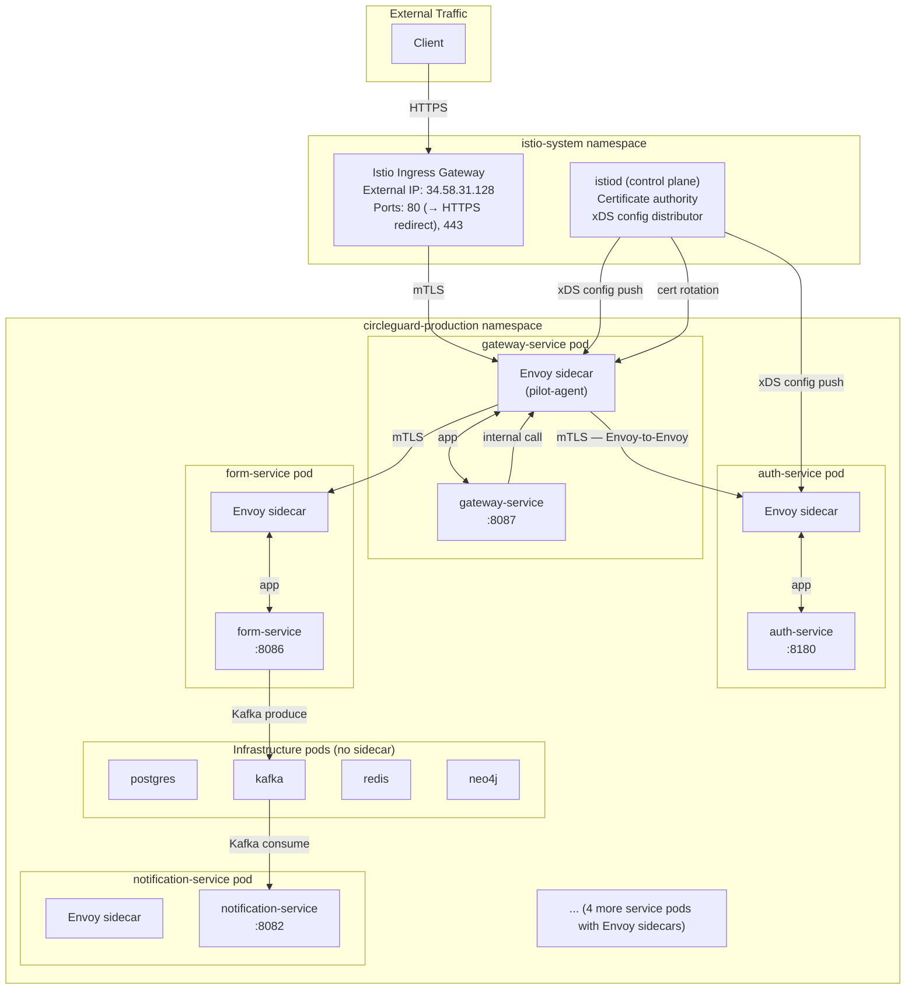

# Istio Service Mesh Topology

CircleGuard uses Istio 1.24.3 in all three environments. This document describes the mesh configuration.

---

## Mesh Architecture



---

## mTLS Enforcement

### PeerAuthentication (STRICT mode)

Applied to every application namespace:

```yaml
apiVersion: security.istio.io/v1beta1
kind: PeerAuthentication
metadata:
  name: default
  namespace: circleguard-production  # also dev, stage
spec:
  mtls:
    mode: STRICT
```

Effect: All pod-to-pod communication within the namespace must use mTLS. Plain HTTP connections are rejected. Infrastructure pods (postgres, kafka, redis, neo4j) have `sidecar.istio.io/inject: "false"` and are excluded from the mesh.

Verify:
```bash
kubectl get peerauthentication -A
# NAME      MODE     AGE
# default   STRICT   ...  (in all circleguard-* namespaces)
```

---

## VirtualServices — Traffic Management

Each microservice has a `VirtualService` in `k8s/istio/*/virtual-services.yaml` providing:

- **Retry policy**: 3 attempts, 2s timeout per attempt, on `5xx,gateway-error,connect-failure,retriable-4xx`
- **Timeout**: 30s per request

Example (auth-service):
```yaml
apiVersion: networking.istio.io/v1alpha3
kind: VirtualService
metadata:
  name: auth-service
spec:
  hosts:
    - auth-service
  http:
    - retries:
        attempts: 3
        perTryTimeout: 2s
        retryOn: "5xx,gateway-error,connect-failure,retriable-4xx"
      route:
        - destination:
            host: auth-service
            subset: v1
          weight: 100
```

---

## DestinationRules — Circuit Breaker

Each service has a `DestinationRule` in `k8s/istio/*/destination-rules.yaml` with:

- **Connection pool limits**: 100 HTTP1 max pending requests, 1000 max requests, 1 max retries
- **Outlier detection (circuit breaker)**: 
  - Ejects a host after 5 consecutive 5xx errors
  - Ejection interval: 10s analysis window
  - Ejection duration: 30s minimum ejection time
  - 100% of hosts eligible for ejection

Example:
```yaml
apiVersion: networking.istio.io/v1alpha3
kind: DestinationRule
metadata:
  name: auth-service
spec:
  host: auth-service
  trafficPolicy:
    connectionPool:
      http:
        http1MaxPendingRequests: 100
        http2MaxRequests: 1000
        maxRetries: 1
        h2UpgradePolicy: DO_NOT_UPGRADE
    outlierDetection:
      consecutiveGatewayErrors: 5
      interval: 10s
      baseEjectionTime: 30s
      maxEjectionPercent: 100
  subsets:
    - name: v1
      labels:
        version: v1
    - name: v2
      labels:
        version: v2
```

---

## Canary Traffic Split

For `gateway-service`, a canary deployment structure is in place. Default is 100% v1, 0% v2:

```yaml
# k8s/istio/production/virtual-services.yaml (gateway-service entry)
route:
  - destination:
      host: gateway-service
      subset: v1
    weight: 100
  - destination:
      host: gateway-service
      subset: v2
    weight: 0
```

To activate a canary (10% to v2):
```bash
kubectl patch virtualservice gateway-service -n circleguard-production --type=merge \
  -p '{"spec":{"http":[{"route":[{"destination":{"host":"gateway-service","subset":"v1"},"weight":90},{"destination":{"host":"gateway-service","subset":"v2"},"weight":10}]}]}}'
```

---

## Observability Integration

Istio automatically emits:
- **Metrics**: Envoy stats scraped by Prometheus (request rate, error rate, latency histograms per service pair)
- **Traces**: Zipkin/Jaeger spans for every request hop (B3 propagation headers)
- **Access logs**: Envoy access logs to stdout (shipped to Kibana via Filebeat)

Access dashboards:
```bash
# Kiali service graph
istioctl dashboard kiali

# Jaeger distributed traces
istioctl dashboard jaeger

# Grafana Istio mesh dashboard
istioctl dashboard grafana
```
