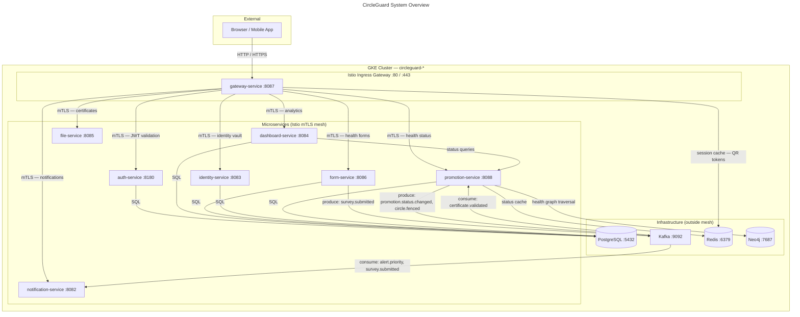

# CircleGuard System Overview

Architecture diagram showing all 8 microservices, their ports, Kafka event flows, and data stores.

---

---

## Service Descriptions

| Service | Port | Responsibility | Data Store |
|---------|------|---------------|-----------|
| `gateway-service` | 8087 | API gateway — QR code validation, Redis-backed sessions, JWT routing | Redis |
| `auth-service` | 8180 | JWT authentication, LDAP integration | PostgreSQL (`circleguard_auth`) |
| `dashboard-service` | 8084 | Geospatial hotspot analytics with k-anonymity privacy filter | PostgreSQL (`circleguard_dashboard`) |
| `file-service` | 8085 | Secure certificate and document storage (S3-compatible) | PostgreSQL (`circleguard_form`) |
| `form-service` | 8086 | Health survey forms, Kafka producer for survey events | PostgreSQL (`circleguard_form`) |
| `identity-service` | 8083 | Identity vault management, FERPA-compliant anonymization | PostgreSQL (`circleguard_identity`) |
| `notification-service` | 8082 | Email and alert notifications, Kafka consumer | None (stateless) |
| `promotion-service` | 8088 | Health status lifecycle management, contact graph traversal | Neo4j, Redis, PostgreSQL (`circleguard_promotion`) |

---

## Kafka Topics

| Topic | Producer | Consumer |
|-------|---------|---------|
| `survey.submitted` | form-service | notification-service |
| `alert.priority` | promotion-service | notification-service |
| `circle.fenced` | promotion-service | notification-service |
| `promotion.status.changed` | promotion-service | notification-service |
| `certificate.validated` | file-service | promotion-service |
